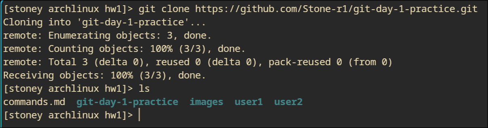
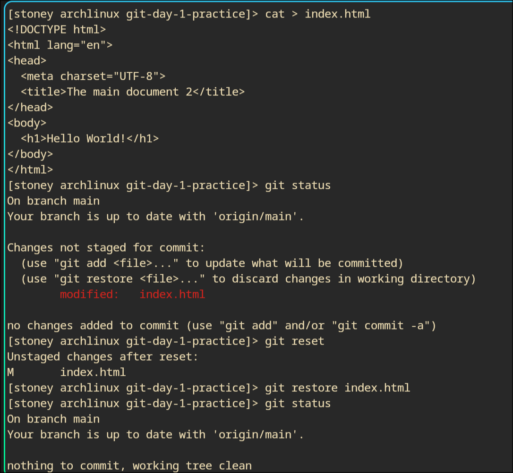

# Ways I approached different tasks

---

## Task - 1 (1)
- Create two directories via `mkdir <name>`
- Clone in specific directory (user1, user2) using command git clone <https> <destination>

## Task - 1
- Created a new repository on github and checked README.md
- cloned it using git clone <https>

---

## Task - 2 (1)
- Move to user1
- Change username using git config user.name "username"
- Add new file `index.hmtl` and fill it with content

## Task - 2
Basically same except for pushing it to github

---

## Task - 3
- First modify `index.html` file
- Check status
- Try using reset + restore

## Task - 3 (1)
- Move to user2 and use command git pull
- Change username using git config user.name "username"
- Create index.css and fill with the relevant content
- Push with `git push -u origin main`

## Task - 4
Everything is present on the following screen

